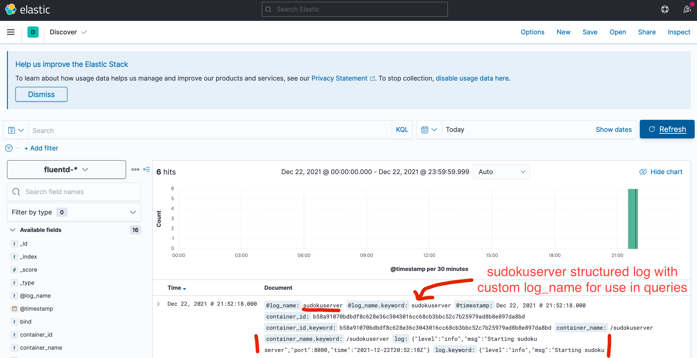

# 100 Days Of Code - Log

## Day 1

November 11, 2021

**Today's Progress**

Installed Go and setup VS Code, followed along the tutorial at https://golang.org/doc/code and the related Youtube video https://www.youtube.com/watch?v=1MXIGYrMk80.

**Thoughts**

I enjoyed getting started. Tools and commands are a lot to grasp at once. Regarding coding, I really noticed how useful it was that I have started with the *Learning Go* book a while ago. I felt I could apply some of the things and did not just copy some content.

**Link to work:** [day001](./day001)

## Day 2

November 12, 2021

**Today's Progress**

Less of a Go than a DevOps day.
Noticed that the one test actually failed. Fixed it and added a github workflow to build and test automatically. Added the badge to the README, that just looks nice.
A bit of ground work, reading about different kinds of for loops in Go. Sorry, no code.

**Thoughts**

Always test. And make sure that tests do run!
I like doing DevOps.

**Link to work:**
- [ReverseString bugfix](https://github.com/sebkraemer/100-days-of-code/commit/db6c39ffa216d7cb17193e3dd90ae10e5ad6fd74)
- [day001 test and build workflow](./actions/runs/1454887039)

## Day 3

November 13, 2021

**Today's Progress**
- Continued to read the *Learning Go* book but didn't find the time to write more flash cards.
- `controls.go` program with playground code with if, for ("four for loops"), break, continue, , labels, switch/case

**Thoughts**
- I need some getting used to opening brackets on the same line..
- wonder how to see the value in the debugger for values declared in scope of if statement, e.g. `if n := getValue(); ..`, VS Code won't show me the value.
- I wonder if fmt.Print does get and sort all values before outputting, because it's always sorted but iterating over the map has a random portion and is nondeterministic.

**Link to work:** [day003](./day003)


## Day 4

November 14, 2021

**Today's Progress**
- updated (added) flash cards
- started chapter about functions
- started with a @codility lesson but couldn’t finish (too late, really 🥱)

**Link to work:** [day004](./day004)


## Day 5

November 15, 2021

**Today's Progress**
- Continued functions topic

**Thoughts**
- I like reading and learning from the book. Sometimes I look up a new topic at [the spec](https://golang.org/ref/spec#Function_types) to see what the language reference says. 🤓📘  Compared to C++, Go's ref is sooo easy to read.
- A quote by @jonbodner from the “Functions” chapter I want to share: *Error handling is what separates the professionals from the amateurs.* ☝️

**Link to work:** --


## Day 6

November 16, 2021

**Today's Progress**

- wrote the book's calculator example from memory, solved it a bit differently, I think
- updated (added) flash cards

**Thoughts**
- It didn't go too bad when writing the calculator while combining several topics that I conquered from the book!
- Still working with the book (which I think is the right thing) does not leave much room for starting more serious coding work. Maybe I should even prioritize the book part to be done with it sooner than later.

**Link to work:** [day006](./day006)


## Day 7

November 17, 2021

**Today's Progress**

- *Learning Go* pages 107-132/340
- added memory chapter flash cards

**Thoughts**
- Interesting chapter abount memory (heap) management and garbage collection.
  It appears Go finds a good tradeoff between performance and using the pass by value approach. Once more I recognize roots of C but leaving out most of its heritage. Even in C++ community, traditionally very performance concerned folks, I have read about the advantages of value based interfaces compared to optimizing performance but making compiler's and developer's work harder to track those variables.

## Day 8

November 18, 2021

**Today's Progress**

- played around with slice memory management, verifying my understanding of subslicing, appending, forced copying of memory blocks (cap exceeded cases)
- did my bit repeating flash cards (as I always do)
- read the article about @antlr with @Golang and discovered struct's embedded fields (just a few pages ahead in my book, hadn't read that yet)
- #100DaysOfCode socializing
- listened to most of "Go time" podcast from @changelog: Building actually maintainable software https://gotime.fm/196

**Thoughts**
- What's with all the WakaTime (sic) tweets in my #100DaysOfCode feed all of a sudden? 🤨
- Behaviour that is hard to describe in detail (many words) are easy to grasp once you get to the roots of it (i.e., understand slice's memory layout and behavior)
- Regarding the podcast I liked the most "Untestable code is unmaintainable code" (uncredited) and "fight for your space and time to keep your software maintainable" (uncredited). And in general it's interesting to see that maintainability has several aspects and how to approach the problem differs in teams and depending on the kind of development phase and product.

**Link to work:** [day008](./day008)


## Day 9

November 19, 2021

**Today's Progress**

- revisited (and solved) codility's binarygap problem (I'm no competitive programmer at this point, that's for sure 😆)
- dabbled with #vscode Go unit testing, but leaving the topic for another day

**Thoughts**

Competitive programming tasks are quite unusual for me so getting to the solution was rather time intensive, given it wasn't a difficult problem.
While practicing these kind of things are generally good, I'm not sure it's the best use of my time *right now*. Programming the solution is rather easy (language-wise) but getting to a working algorithm is a much greater part of the challenge. And I'm here for learning to apply the language.

I also had a bit of a problem with the local `binarygap` module but it was fixed by not registering the package in the subfolder.

No book reading today, I'm afraid.

**Link to work:** [day009](./day009)


## Day 10

November 20, 2021

**Today's Progress**

- solved confusion about %q and %c format specifiers
- revistied method calling on nil pointer, can be OK!
- *Learning Go* pages 133-145/340

**Thoughts**

Possibly genius but it needed a second though to grasp this:

```
var it *IntTree // zero value: nil
it = it.Insert(5) // might panic or not
```

works because a method can be called on a nil instance. If it is implemented to support the case, good things happen.


## Day 11

November 21, 2021

**Today's Progress**

- *Learning Go* pages 146-157/340

**Thoughts**

Nontrivial stuff in the Interfaces chapter. It’s slowing me down 😞 but I also realise that this is essential stuff.

It’s true that Go is always famous for its concurrency model but not for its implicit interfaces.


## Day 12

November 22, 2021

**Today's Progress**

- *Learning Go* pages 157-160/340, finishing Interfaces chapter with Dependency Injection
- Bootstrapped fints-go, a parsing project in Go.

**Thoughts**

Apparently functions are a so much first class citizens that you can even declare methods on them, and this can be used to implement an interface. 🙇‍♂️ It's quite fascinating.

I don't find the tweet right now that I stumbled upon today (it was a #100DaysOfCode one!), anyway it recommends a 70/30 practicing to stuying ratio for learning a new topic. I'm too much on the learning side. On the other hand, maybe that ration changes and it's good to have a stronger theory part when starting off to code your project.

Interface chapter is not so straightforward to put into flash cards and I certainly don't want that holding me back any longer. Will have to get back to it. However, I believe some concepts have become clear by now.

Build!

**Link to work:**

Today's commit: [81402b5](https://github.com/sebkraemer/100-days-of-code/commit/81402b580ca06f3c05c80321dedb9fb3740a93f8)

Project: [fints-go](./projects/fints-go) (This will contain more than I wrote today when you check it out later.)


## Day 13

November 23, 2021

**Today's Progress**

- *Learning Go* pages 161-170/340, starting *Errors* chapter
- Playing with type and interface
- Filing an errata on the book ☝️
- ~~continued with fints-go~~

**Thoughts**

The Go parser from ANTKR needs some love, apparently there is generated AST visitor code but it's not as straightforward and easy to setup (and not as idiomatic?) in the Go version as for other languages.
I had dabbled with it with python and JavaScript and also found there that the quality isn't on par with the Java version, which is the prime citizen, I believe. See e.g. [issue #1807](https://github.com/antlr/antlr4/pull/1807).

Not sure what to make of it and how far I should take this project idea.

I was happy to feel comfortable writing an interface and type switch case and type conversion on the playground. Don't even know what led me to do it, but please see [today's log](./day013) for the story.

**Link to work:**

Today's commits: 
- [day013](./day013)
- Project: [fints-go](./projects/fints-go)


## Day 14

November 24, 2021

**Today's Progress**

- *Learning Go* pages 171-202/340, finishing Errors chapter and also completing Packaging chapter. 📖

**Thoughts**

No new flash cards and no coding but I hope this does count anyway..

Next up: Concurrency! 🤩  In a way I'm of course looking forward to it, on the other hand I feed it's not the most important thing to cover next..


## Day 15

November 25, 2021

**Today's Progress**

- had to create a few flash cards, I'm running out of reviews soon
- picked up the fints-go idea and made the project compile

**Thoughts**

For getting the project to build, I had to fight a bit with local package dependency; in the end I successfully used `replace()` in my `go.mod` 😀 (The book mentions `replace` but unfortunately doesn't explain it further.)

```go.mod
replace (
   github.com/sebkraemer/100-days-of-code/projects/fints-go/pkg/parser => ./pkg/parser
)
```

Going further, I did notice that the Go ANTLR target, at least the visitor implementation I intended to use, has bigger problems than anticipated (see [here](https://github.com/antlr/antlr4/issues/2504) and extensive comments [here](https://github.com/antlr/antlr4/pull/1841#pullrequestreview-66582914)) and I'm not sure I want to go down that path. I could still try to come up with a POC but reimplementing every base method is not feasable for a grammar that will grow large quickly, and the FinTS one would. An example of someone who made the effort for a simple calulator (minum set of rules) can be seen [here](https://github.com/DavidGamba/go-antlr-calc).

Using SomeType.New() object creation seems to be a thing.

Have to look up `go generate`.

**Link to work:**

- Today's commits: https://github.com/sebkraemer/100-days-of-code/commit/8ca9d1dfdd5c77bfc287f1cb6b2598956772b64a
- Project: [fints-go](./projects/fints-go)


## Day 16

November 26, 2021

**Today's Progress**

- Started sudoku solving project but got a bit stuck in the early stage. Better progress next time! 🤞


## Day 17

November 26, 2021

**Today's Progress**

- ❌ no coding today 🤭

- ✅ spent the whole evening with my wife 😇

- Started chapter about standard library and had a brief look at backtracking.


## Day 18

November 28, 2021

**Today's Non-Progress**

intentionally left blank


## Day 19

November 29, 2021

**Today's Progress**

- continued on sudoku
- early stage: print support, test layout assumptions
- used stringer interface for printing support
- used strings.Builder
- inspected array memory layout (row major, of course, like in C 🙂)

**Thoughts**

After a break, coding was fun and I feel motivated with some things in mind where to go with this toy project.

Implementing String() made me realize what I already knew: It has nothing to do with operator overloading, which go does not support.
I believe that would be against the philosophy of Go that things should not be hidden or obfuscated, even if that means more code.
This does not mean that odules like `fmt` can't use whatever mechanism (reflection?) to check for an interface and handle things comfortably.

**Link to work:**

- Today's commits: https://github.com/sebkraemer/100-days-of-code/commit/b4806f9491889806f2d8bb29d726765ce8118564
- Project: [sudoku-go](./projects/sudoku-go)


## Day 20

November 30, 2021

**Today's Progress**

- finished first version of backtracking sudoku solver, it solved an example sudoku ✅

**Thoughts**

- Finally implemented this. Had backtracking on my list for too long!
- The mix of bool and error type which I started with felt weird for the helper functions and recursion results; ended up with bools only.
- Stringer interface does only work with `fmt` if fields are not exported!

**Link to work:**

- Today's commits: https://github.com/sebkraemer/100-days-of-code/commit/11125a10752a101371b78d03c1050482e6bbbc5a
- Project: [sudoku-go](./projects/sudoku-go) with updated README


## Day 21

December 1, 2021

**Today's Progress**

- Couldn't resist and started the testing chapter
- turned a sudoku test into a benchmark test
- flash-carded the benchmark section

**Thoughts**

I don't see a good way to have code written both for a test and a benchmark without code duplication or extracting into a yet another function. I feel that the latter would hurt readibility, but maybe it doesn't.

**Link to work:**

- Today's commits: https://github.com/sebkraemer/100-days-of-code/commit/621ec13634d1fa72727b2d7e8dc284df990e9ebf with benchmark output
- Project: [sudoku-go](./projects/sudoku-go)


## Day 22

December 2, 2021

**Today's Progress**

- Revisiting modules and flash-carding
- Finally understood Minimal Version Selection 🎯 after reading a great article by @goinggodotnet, the example in the book had me confused.
  https://t.co/kJoulWbWN1

no code to share today, sorry

**Thoughts**

It felt good to create new cards and work with the book again. While it feels a bit wrong to skip on the coding/practical side, I notice that I'm writing down stuff on cards for repetition that I had read but rather forgotten the specifics about.

**Link to work:**

- Today's commits: https://github.com/sebkraemer/100-days-of-code/commit/621ec13634d1fa72727b2d7e8dc284df990e9ebf with benchmark output
- Project: [sudoku-go](./projects/sudoku-go)


## Day 23

December 3, 2021

**Today's Progress**

- Started looking into web services with go and implemented a *hello world* for you guys.
- Also peeked into AWS Lambda as a candidate for future serving my sudoko solver but I concluded quickly that this is a larger topic on its own.
  I consider it as a serverless option for the soduko solver.

**Thoughts**

It appears I've gotten used to put the opening curly brace on the same line as the introductory declaration.

It's just fascinating how easy it is to ramp up a webservice in Go (coming from C++, that is)

**Link to work:**

- Today's commits: https://github.com/sebkraemer/100-days-of-code/commit/232c7d9a3f99050f852c86e242bd56913fed4d58
- Project: [day023](./day023)


## Day 27

December 7, 2021

**Today's Progress**

- Took the @pluralsight lab "Build a FIFA World Cup Web Service in Go"
  (which sounds like quite more work than it was)

**Thoughts**

The project was in a way too easy because it dictated what to write. Still, I got a good impression on how to write
the handlers. Also, there is http request testing code which I can use for my own future service tests.
I felt comfortable to write the Go code.

The project used local packages which seemed pretty straightforward. I wonder if my approach was too complicated, and maybe I misunderstood the best practices.

It's interesting to note that passing an interface as parameter can include (is always) pointer type although it does not look like it in the parameter list (concrete example: `http.ResponseWriter`).

**Link to work:**
- Commits: https://github.com/sebkraemer/golang-fifa-world-cup-web-service/commits/3b068f9f1c43ce0d8204faf7cc9c3f74010389aa
- Project: [golang-fifa-world-cup-web-service@3b068f9 submodule](./projects/)


## Day 28

December 8, 2021

**Today's Progress**

- added a few (yet failing) http.Handler tests for the sudoku web service

**Thoughts**

It’s still a zoo with all the involved types, esp. as there are different ways to solve things.
Will need to investigate and familiarise.

**Link to work:**
- Commits: [https://github.com/sebkraemer/100-days-of-code/commit/b1dd6952c8026b56114375139d8107c74b995d36](https://t.co/0uPzC8W131)
- Project: [sudoku-go](./projects/sudoku-go)


## Day 29

December 9, 2021

**Today's Progress**

After I felt I lost a bit track of the foundations I spent some time with the book:

- Read *io and friends* and *time* sections from chapter 11
- found and reported a typo
- created fresh supply of flash cards (“fresh cards” haha)


## Day 30

December 10, 2021

**Today's Progress**

N/A


## Day 31

December 11, 2021

**Today's Progress**

- Implemented the HTTP request handler to make checks and process the input, i.e., solving and returning the solved sudoku data

**Thoughts**

Feels good to code and when tests turn green ✅
Wonder how to architest the whole web service application, incl logging and mature muxer, HTTP API design..
The Reader interface of request body and json decoder, things are falling into place.

**Link to work:**
- Commits: https://github.com/sebkraemer/100-days-of-code/commit/9b003b3b14307572de1a94b2fc2c8b9a56cdb7b6
- Project: [sudoku-go//cmd/sudokuserver](./projects/sudoku-go/cmd/sudokuserver)


## Day 32

December 12, 2021

**Today's Progress**

- Pluralsight course *Creating Web Services with Go* by @AlexCSchultz
- Moved HTTP handler code to a running service

**Thoughts**

Two ways to start the http server:
- 'static'
  - http.Handler(...)
  - http.ListenAndServer(port, muxer=nil)
- custom with more control
  - s := http.Server{.., Handler: FooHandler{}}
  - s.ListenAndServer()

I should download and review th course source code, I wondered that one place where the handler was passed as `&handler` (I think), why was it done this way?

**Link to work:**
- Commits: https://github.com/sebkraemer/100-days-of-code/commit/ec98da5da2743b55fccddc2b297b187bb96d099c
- Project: [sudoku-go//cmd/sudokuserver](./projects/sudoku-go/cmd/sudokuserver)


## Day 33

December 13, 2021

**Today's Progress**

- Converted some handler tests to table tests format
- Produced fresh cards
- Some random topic reading, making notes for several things to get back to later.
- buffer, reader, strings usage

**Thoughts**

- I somehow confused httptest.NewServer as something I could use but I didn't need to simulate the server.
- Happy that VS Code supports table tests out of the box.
- Various specific notes were floating around my head, made notes and read spec and blogs. Things to come back to later.
- Surprisingly learned the debug console and watch feature in the "Getting Started" VS Code youtube video.

**Link to work:**
- Commits: https://github.com/sebkraemer/100-days-of-code/commit/0850530ae0edc296eedc9308ad9cf8bf371605e0
- Project: [sudoku-go//cmd/sudokuserver](./projects/sudoku-go/cmd/sudokuserver)


## Day 34

December 14, 2021

**Today's Progress**

No coding. Setting up docker via minikube, but it’s not quite working yet. Really looking forward to building that docker image of the solver service!

It’s been some time since I used docker actively..


## Day 35

December 15, 2021

**Today's Progress**

Continuing the journey with minikube and finally connected to my service.

None of these tutorials tell you what’s necessary to simply `docker run -p ..` something and how to connect — without kube deployments.

Now do I want to dive into k8s yet..? (Probably not.)


## Day 36

December 16, 2021

**Today's Progress**

- Learned about using environment variables inside Go program.
- Learned about crossplatform Go builds with GOOS and GOARCH.
- Learned about Docker multiplatform builds, didn't know that.

**Thoughts**

Couldn't really follow the course regarding the multiplatform docker build because I couldn't get the `buildx` command running with my brewed docker and minikube.
Not saying it's not possible but it's not my focus right now.
It's a bit sad though and probably mainly a konsequence of not having Docker Desktop.
Should I switch to my (kind of neglected) Linux system?

Multi-platform docker gets me in the mood to try that on my (also neglected Raspberry Pi! 😁

**Link to work:**
- Commits: https://github.com/sebkraemer/100-days-of-code/commit/2736c3edeed9f533ff4bbc7ca26f18fdd0e5b719
- Project: [sudoku-go/cmd/sudokuserver](./projects/sudoku-go/cmd/sudokuserver)


## Day 37

December 17, 2021

**Today's Progress**

- Refresher on multi-stage docker builds, learned about static linking with `CGO_ENABLED=0` and docker’s special `FROM scratch`, wow.
  Reduced image size from ~1GB to 6 MB 😅
- Create Dockerfile for multistage build

**Link to work:**
- Commits: [https://github.com/sebkraemer/100-days-of-code/commit/8c4692ac2683688088221f5b75456d2ec0f62ba2](https://t.co/orJ8w2tB2X)
- Project: [sudoku-go/cmd/sudokuserver](./projects/sudoku-go/cmd/sudokuserver)


## Day 38

December 18, 2021

**Today's Progress**

- delve dbg server in docker (peek)
- structured logging with [logrus](https://github.com/Sirupsen/logrus)

I got a bit lost again in setting up a local non-internal package, will still have to find “best” way. Seeing questions and solutions (like `GO111MODULE=on`) tell me I’m not alone with this.


## Day 39

December 19, 2021

**Today's Progress**

N/A


## Day 40

December 20, 2021

**Today's Progress**

- probably solved the local module mystery
- added logrus logging to service
- ran example for docker compose, want to utilize it for advanced logging infra
- looked into fluentd, prometheus, ELK

**Link to work:**
- Commits: https://github.com/sebkraemer/100-days-of-code/commit/0767a12064a36d04fa496e46d8aeb80cc1cdc122
- Project: [sudoku-go//cmd/sudokuserver](./projects/sudoku-go/cmd/sudokuserver)


## Day 41

December 21, 2021

**Today's Progress**

- worked through docker-compose course by @DanWahlin 👍
- took pluralsight Go skill iq assessment
  
- created docker-compose for my service ..but failed to get fluentd running, my config gets always mounted as directory?! 😞

**Thoughts**

It was real fun to refresh docker knowledge and dive into docker compose which I had not used yet.
Not so much fun: getting stuck, wasting my time (or not) with a bad docker file mount (see yesterday's log) which prvents fluentd to start with my config!

Message by pluralsight: "My Go Core Language IQ is 180—that’s better than 69% of my peers! What's your #PluralsightIQ? https://app.pluralsight.com/score/redir/4276a8cf-2efe-4aa3-b2ab-b77a44591bab?2294cfd2d0"
I guess I could have done better if I had covered the concurrency and channels topic already. But anyway, it's not too bad. ✌️

**Link to work:**
- Commits: [https://github.com/sebkraemer/100-days-of-code/commit/a4dfcc4f8e13fb147c9825c8c4ecaf0ac69c2d60](https://t.co/YZSZq9oKfI)
- Project: [sudoku-go//cmd/sudokuserver](./projects/sudoku-go/cmd/sudokuserver)


## Day 42

December 22, 2021

**Today's Progress**

- The approach for logging from docker that I got from that pluralsight video is superseded by simply using the `fluentd` docker logger, so I'm implementing that 🦾 (fluentd pluging)
- extended docker setup to push logs to ELK stack; fought extensively with fluentd and docker log tags.. but succeeded 👇
  
  This is how my service shows up in kibana. Not so interesting content-wise but well-structured for KQL queries and filtering: json format that can be further parsed (in kibana or even before in fluentd) and filtered e.g. by its tag.
- participated in [fluentd github issue #297](https://github.com/fluent/fluentd-docs-gitbook/issues/297#issuecomment-999889845) because the docker compose example from the docs does not work as expected, causing me some headache
  

**Thoughts**

`links`, `depends_on`, `network`.. similar functionality and changing best practices (and behavior of docker-compose?) can be confusing when different tutorials and documentation each states its own way of doing things. I think I got it right with just `depends_on`.

It’s awesome that docker logs allows plugins that will push right to a service (well, cloud collector usually), learned that

Hm, elasticsearch changed their business model, apparently the free OSS version won't be maintained any more. Quite some news! Grafana Loki as alternative?

**Link to work:**
- Commits: [https://github.com/sebkraemer/100-days-of-code/commit/a4dfcc4f8e13fb147c9825c8c4ecaf0ac69c2d60](https://t.co/YZSZq9oKfI)
- Project: [sudoku-go/cmd/sudokuserver](./projects/sudoku-go/cmd/sudokuserver)
- Docker-compose example does not work correctly #297: https://github.com/fluent/fluentd-docs-gitbook/issues/297#issuecomment-999889845


## Day 43

December 23, 2021

**Today's Progress**

- waded through half of concurrency chapter in *Learning go*
- Spent time with family 🎄


## Day 44

December 24, 2021 🎄

**Today's Progress**

- Goroutines: experiment with done channel pattern and (as I call it) implicit cancellation

**Thoughts**

- Goroutines, finally 😎
- I find it interesting that when the first worker returns and the otheres are still running (in sleep), they get canceled or whatever, the calling function does not wait for the slowest worker and exits cleanly.
  This is different to what I would expect in classical thread.join() scenarios threadpool scenarios.
- Gotcha! I'm glad I experienced the pitfall of capturing the reference to a loop counter in a closure instead of the value -- better learn that now than later
- Deadlock detection (experienced it) is an interesting feature


**Link to work:**
- Commits: https://github.com/sebkraemer/100-days-of-code/commit/bb7800b202bd27ae2c8a745a3e6a6baf6e29c02e


## Day 45

December 25, 2021

**Today's Progress**

revisit yesterday's open questions:
- it's OK to not close a channel if the program logic doesn't depend on it (I notied that by no apparent program behavior yesterday when I first had forgotten the close())
  https://stackoverflow.com/a/36613932/4312669
- goroutine was not 'killed' when closing the calling function or closing its destination channel. That showed when adding a sleep() at the end of the program, the printfs were still showing.
  Presumably a cancellation context would be needed for stopping a worker prematurely.

**Link to work:**
- Commits: https://github.com/sebkraemer/100-days-of-code/commit/9e4ccb254e4f740ef8004d9d208726f5831119e1


## Day 46

December 26, 2021

**Today's Progress**

- Solved goroutine lifetime question, see yesterday’s log
- Started pluralsight course ‘Introduction to AWS Lambda’ by @fmc_sea — pretty clear so far, will hopefully enable me to quickly deploy the Go web service (looks rather doable so far!)


## Day 47

December 27, 2021

**Today's Progress**

- continued course about AWS lambda
- created AWS account

**Thoughts**

Sometimes it is instructive to just navigate and enter the official docs, which in case of AWS are excellent as far as I can tell already.
I feel I spent too much between tutorials without concrete outcome.
Sometimes an essential (for me) part is missing, other times the goal is different to what I need.
AWS installation and configuration is missing both in pluralsight's courses I watched and also the *AWS Lambda with Go* written tutorial.

https://docs.aws.amazon.com/lambda/latest/dg/welcome.html


## Day 48

December 28, 2021

**Today's Progress**

- went from video course to digging through AWS docs — this is HUGE!
- installed AWS cli

**Thoughts**

It feels like I didn't get anything done today.. Information overload. AWS landscape is so big I got lost.
The AWS CLI installer failed when I tried to install only for the current user on MacOS 🤨.

## Day 49

December 29, 2021

**Today's Progress**

- created IAM accounts for Admin and lambda user, used role `AWSLambda_FullAccess`
- after that, got the ‘AWS Lambda in Go’ sample from @megaproaktiv running ✌️🤗 thanks so much!


**Thoughts**

Feels so great to *finally* have something running, something I have never done before! 🥲

**Links**

- https://go-on-aws.com/lambda-go/
- configure AWS CLI: https://docs.aws.amazon.com/cli/latest/userguide/cli-chap-configure.html
- AWS best practice, create IAM administrator account: https://docs.aws.amazon.com/IAM/latest/UserGuide/getting-started_create-admin-group.html


## Day 50

December 30, 2021

**Today's Progress**

- playing with json stream encoding/decoding
- created new flash cards after a long time of only repeating
- reported errata in Learning go playground link

**Thoughts**

Once I work on the book I feel I'm neglegcting the project and vice versa.
There's just not enough time, even (or especially) during time around Christmas.


## Day 51

December 31, 2021

**Today's Progress**

*skipped, just with friends celebrating last day of 2021*

**Thoughts**

Following through with flash card learning was hard in the last days due to visitors and celebration. But I did it. No zero days at that front.


## Day 52

January 1, 2022

**Today's Progress**

- migrated my little sudoku solver to run on AWS lambda! 🤩


**Thoughts**

It works and wasn't hard but I feel like I only know half (or less) of what I'm doing AWS-wise.
This is only a glimpse of what is happening out there everyday.

Example for not knowing what I'm doing: the first attempt at running the function failed because I had not named it 'main', both handler and binary.
Apparently, the binary's name is *not* deliberate.

~~I should really cleanup the log and add the older entries.~~ (done)

**Link to work:**

- Commit: [https://github.com/sebkraemer/100-days-of-code/commit/510427fc178ee7662485c789353ed11bbff5f897](https://t.co/cQBtDZWqrD)
- Project: [sudoku-go/cmd/sudokusolver-lambda](./projects/sudoku-go/cmd/sudokusolver-lambda/)


## Day 53

January 2, 2022

**Today's Progress**

A new year and past 50 days, I took a day to cleanup some debt.

- closed dozens of open browser tabs, added notes for things I want to get back to
- “fresh cards”
- added quite a few missing entries to the log

**Thoughts**

It felt good to revisit these last few weeks.
Although everyday change feels small usually, sometimes stuck and always time limited, I'm seeing that I accomplished something.
On the other hand, it's not so much strictly following a Go project..

It appears some more folks start following me without me knowing them.
I even don't tweet much of useful links..
So that's a bit surprising but feels good.

**Link to work:**

- Commit: [https://github.com/sebkraemer/100-days-of-code/commit/4b2432bd60253e43bdac79176b8c73cb1310468c](https://t.co/4KWOYUdl2X)


## Day 54

January 3, 2022

**Today's Progress**

- more housekeeping, adding missing logs and projects
- For some reason I divert and looked into UML. Plan is to create flash cards.
- I cheated and imported a Go flash card deck created by @cflynn07, shared via [Gist](https://gist.github.com/cflynn07/1b391ab97c6837582a3a4b653f842fce).
  There's overlap already but I'm intrigued how well I'll manage to answer the cards.

**Thoughts**

I suspect the change in direction is at least in part due to the fact that I'm not sure where to go (sic) with the challenge.
