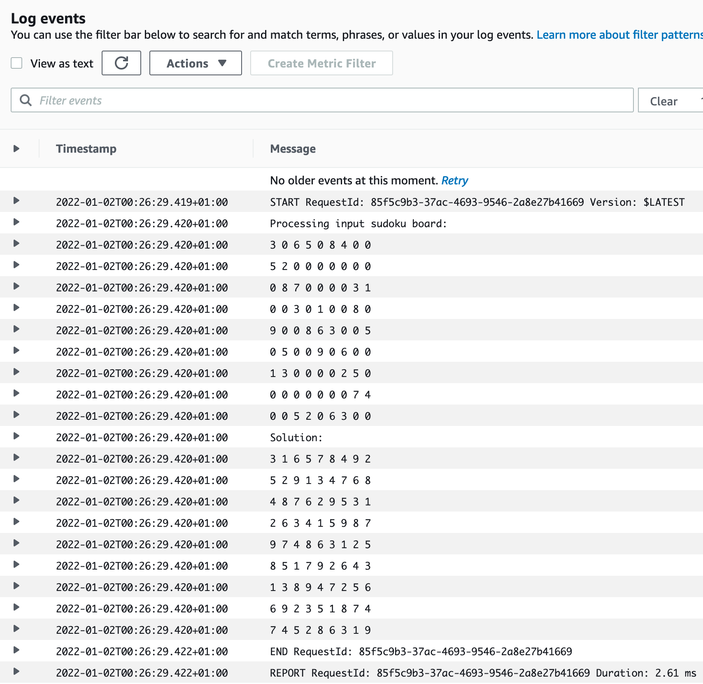

# sudokusolver-lambda

Proof of concept project to let my sudoku solver run on AWS lambda.

Lambda part is Based on [AWS Lambda in Go](https://www.go-on-aws.com/lambda-go/) by @megaproaktiv.

# HOWTO

These instructions assume that a `sudokusolver` lambda function is already setup and that aws console has access to it.

```
env GOOS=linux GOARCH=amd64 go build -ldflags="-s -w" -o ./dist/main main.go

cd ./dist && zip main.zip main && cd ..

aws lambda update-function-code --function-name  sudokusolver --zip-file fileb://./dist/main.zip

aws lambda invoke --function-name sudokusolver --payload fileb://testdata/sudoku-event.json testdata/sudoku-response.txt
```

# Result

sudoku-lambda-logs

# References

- https://github.com/aws/aws-lambda-go
- https://github.com/megaproaktiv/go-on-aws-source
